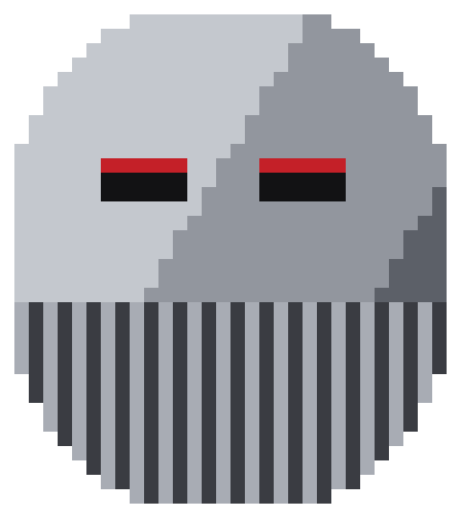
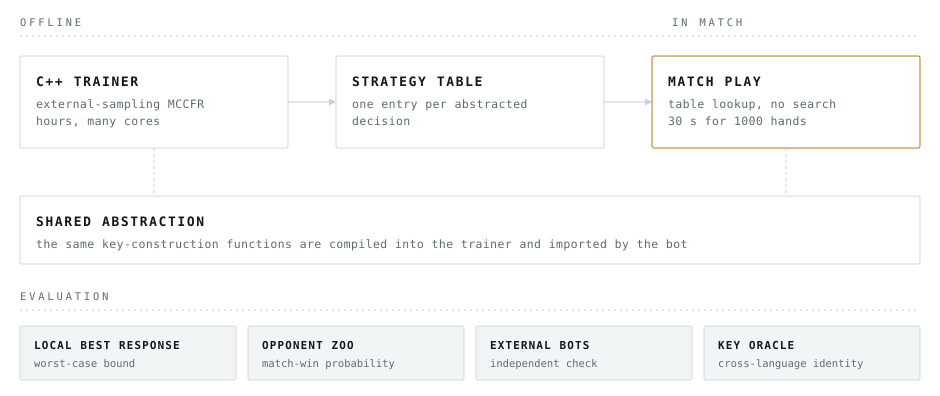

<div align="center">



# DOOMSDAY

**Heads-up no-limit poker · MIT Pokerbots 2027**

[](https://mehtaarnav.github.io/pokerbots-2027/)
[](LICENSE)

</div>

---

A heads-up no-limit poker agent for [MIT Pokerbots 2027](https://pokerbots.org),
built as a training and evaluation platform rather than a single strategy.

## The constraint

Pokerbots is an annual MIT competition. Entrants write an agent that plays
heads-up no-limit poker against other teams' agents. Each bot is allotted
30 seconds of compute for a 1000-hand match, and the game variant is not
announced until early January.

The variant being unknown is what shapes the design. Anything tuned to a
specific ruleset has to be rebuilt once the announcement lands, so the parts
that survive are the pipeline and the instruments.

## The approach

<picture>
  <source media="(prefers-color-scheme: dark)" srcset="assets/architecture-dark.svg" />
  
</picture>

The strategy is computed offline. A C++ trainer approximates equilibrium play
with Monte Carlo counterfactual regret minimization and writes a table holding
one entry per abstracted decision. During a match the bot maps the current
state into that abstraction and reads the stored response, so a decision costs
a table lookup and no search runs at the table.

The abstraction has one implementation. The same key-construction functions are
compiled into the trainer and imported by the Python bot, so the state the
trainer learned and the state the bot looks up are the same state. A
cross-language oracle checks that property directly.

Evaluation is a subsystem rather than a final step. Four instruments cover
different failures: a local best response bound, an opponent zoo scored by
match-win probability, external opponents this project did not write, and the
key oracle.

The game interface confines dealing, hand ranking and betting structure to one
place. The solver, the abstraction and the evaluation code are
variant-independent, and five variants are implemented behind the interface as
a readiness check.

## See it work

Three pages, each a single self-contained file with no build step and no
dependencies.

| | |
|---|---|
| **[Project page](https://mehtaarnav.github.io/pokerbots-2027/)** | The architecture and how it is measured. |
| **[Kuhn poker, solved live](https://mehtaarnav.github.io/pokerbots-2027/kuhn.html)** | Counterfactual regret minimization running in the browser against a three-card game small enough to have a known exact solution. It converges from scratch, then deals you hands against the strategy it just derived. Textbook material, and nothing about the competition entry. |
| **[Hand replayer](https://mehtaarnav.github.io/pokerbots-2027/replayer.html)** | Steps through a match hand by hand: hole cards, board, betting, pot and stacks. Drop an engine `gamelog.txt` onto it. |

## This repository

```
assets/     the mark and the architecture diagram
site/       source for the pages above, published from the gh-pages branch
LICENSE     MIT
```

The agent, the trainer and the evaluation code are held back while the variant
and the competition are still ahead. This repository is the public front door.

## Status

In active development ahead of January 2027.

*Team Doomsday.*
